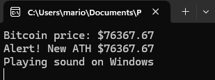

# Silicon Valley Bitcoin Alert




# Gilfoyle-Bitcoin-Alert : <small>Bitcoin is Really Volatile Today</small>

This programme monitors the price of Bitcoin and issues a sound alert when a new All-Time High (ATH) is reached, or if the price falls below a predefined threshold.

## API: CoinMarketCap
The programme uses the CoinMarketCap API to retrieve the current price of Bitcoin. An API key from CoinMarketCap is required, which you can obtain at [CoinMarketCap API](https://coinmarketcap.com/api/documentation/v1/#).

**Note**: If the programme does not execute correctly, try replacing the API key in the source code with your own API key.

## Features
<ul>
  <li>If Bitcoin reaches a new ATH, the programme will play a sound alert using an audio file (by default, a `.wav` file from Napalm Death).</li>
  <li>If Bitcoin’s price drops below a specified threshold, it also triggers an alert.</li>
  <li>The price is fetched in real-time from the CoinMarketCap API.</li>
  <li>The default currency is USD, but this can be modified in the source code as desired.</li>
  <li>The programme checks the Bitcoin price every minute to provide frequent updates.</li>
</ul>

## Requirements and Installation
This programme is designed to work on Windows, macOS, and Linux.

### Installation
1. Ensure `curl` is installed on your system, as the programme uses it to make HTTP requests.
2. Clone this repository.
3. Compile and run the `.c` file in your environment.

### Compilation and Execution
To compile and run on a UNIX-based system (macOS or Linux):

```bash
gcc bitcoin_alert.c -o bitcoin_alert
./bitcoin_alert
